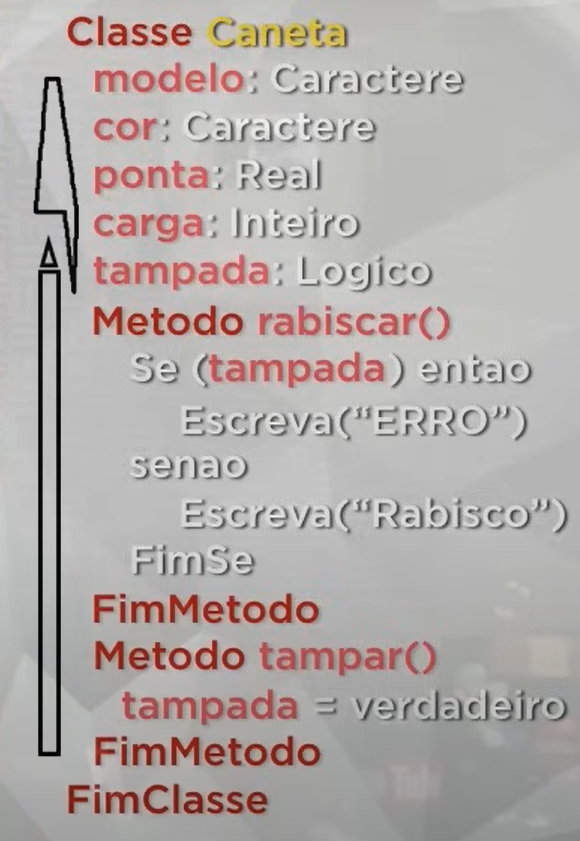

# **Curso PHP POO: [40 HORAS]**

# Capitulo 1: O que é um Objeto?

Na definição dos livros, um objeto é:

> **Objeto:**
Uma coisa material ou abstrata que pode ser percebida pelos sentidos e descrita por meio das suas características, comportamentos e estado atual.
> 

Um exemplo de Objeto, é uma caneta, pois atende a TODOS os requisitos citados acima, com isso construiremos a Classe desse Objeto.

## 1.1 Classe

As classes são modelos/plantas/padrões que são definidos antes da criação do Objeto a partir da mesma. Agora vamos criar a classe de nossa caneta.



Na criação de classes conseguimos adicionar informações e funções na mesma, onde em sua estrutura adicionaremos Atributos, Métodos e Estado.

- Atributos: Informações que adicionaremos na construção de nossa Classe
- Métodos: Funções que o Objeto realizara, podendo modificar atributos

### 1.1.1 Atividade

- Identifique dois objetos físicos do seu ambiente e classifique-os.

| Xícara | Celular |
| --- | --- |
| Tamanho | Marca |
| Capacidade | Modelo |
| Cor | Ligado |
| Cheia |  |

```php
class Celular{
	var $marca;
	var $modelo;
	var $ligado;
	var ligarCelular(){
		if ($this->ligado == false){
			$ligado = true;
		}
	}
	public Class mexerCelular(){
		echo "<p>Estou mexendo</p>";
	}
}
```

```php
class Xicara{
	var $tamanho;
	var $capacidade;
	var $cor;
	var $cheia;
	
	public function encherXicara(){
		if($this->cheia == false){
			$cheia = true;
		}
	}
}
```