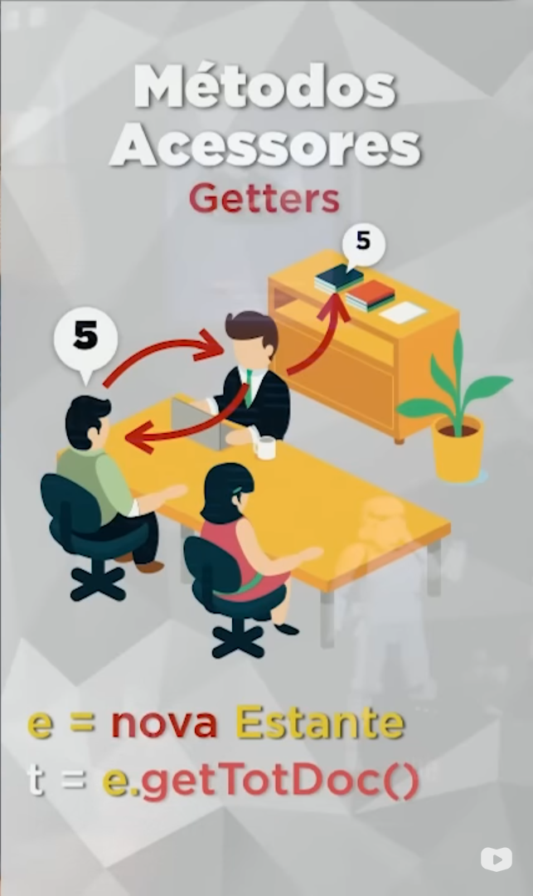
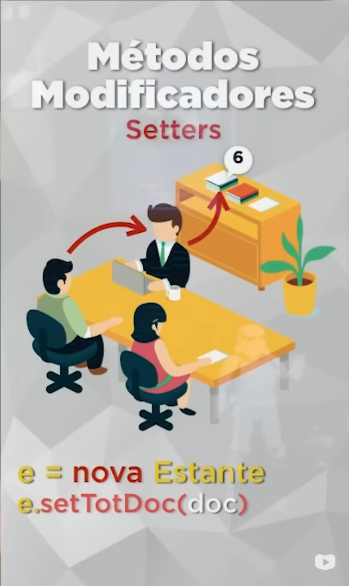
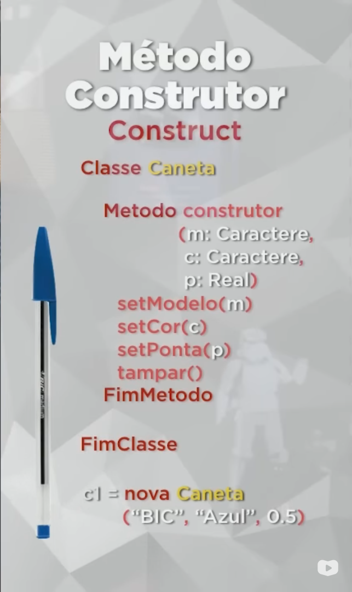
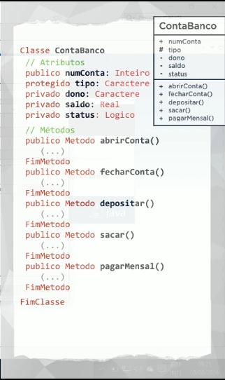

# **Curso PHP POO: [40 HORAS]**

# **Aula Teórica 2 – O que é um Objeto?**

Na definição dos livros, um objeto é:

> **Objeto:** Uma coisa material ou abstrata que pode ser percebida pelos sentidos e descrita por meio das suas características, comportamentos e estado atual.

Um exemplo de Objeto, é uma caneta, pois atende a TODOS os requisitos citados acima, com isso construiremos a Classe desse Objeto.

## 1.1 Classe

As classes são modelos/plantas/padrões que são definidos antes da criação do Objeto a partir da mesma. Agora vamos criar a classe de nossa caneta.

Na criação de classes conseguimos adicionar informações e funções na mesma, onde em sua estrutura adicionaremos Atributos, Métodos e Estado.

- Atributos: Informações que adicionaremos na construção de nossa Classe
- Métodos: Funções que o Objeto realizara, podendo modificar atributos

### 1.1.1 Atividade

- Identifique dois objetos físicos do seu ambiente e classifique-os.

|Xícara|Celular|
|---|---|
|Tamanho|Marca|
|Capacidade|Modelo|
|Cor|Ligado|
|Cheia||

```php
class Celular{
	var $marca;
	var $modelo;
	var $ligado;
	
	public function ligarCelular(){
		if ($this->ligado == false){
			$ligado = true;
		}
	}
	public function mexerCelular(){
		echo "<p>Estou mexendo</p>";
	}
}
```

```php
class Xicara{
	var $tamanho;
	var $capacidade;
	var $cor;
	var $cheia;
	
	public function encherXicara(){
		if($this->cheia == false){
			$cheia = true;
		}
	}
}
```

# **Aula Teórica 3 – O que é Visibilidade em um Objeto?**

## 3.1 Linguagem de Modelagem Unificada (UML)

A UML é uma forma simples de representar um sistema complexo, podendo ser na parte de POO ou na representação de relacionamentos de Bancos de Dados.

### 3.1.1 Diagrama de Classes

O diagrama de Classes é utilizado para a representação de Classes, em um programa, mostrando de forma simples seus Atributos, Métodos, Visibilidade etc…

<div style="display:flex;">
	<table >
		<tr>
			<th>Caneta</th>
		</tr>
		<tr>
			<td>+ modelo</td>
		</tr>
		<tr>
			<td>+ cor</td>
		</tr>
		<tr>
			<td>- ponta</td>
		</tr>
		<tr>
			<td># carga</td>
		</tr>
		<tr>
			<td># tampada</td>
		</tr>
		<tr>
			<th></th>
		</tr>
		<tr>
			<td>+ escrever()</td>
		</tr>
		<tr>
			<td>+ rabiscar()</td>
		</tr>
		<tr>
			<td>+ pintar()</td>
		</tr>
		<tr>
			<td>- tampar()</td>
		</tr>
		<tr>
			<td>- destampar()</td>
		</tr>
	</table>
	<div>
		<p>Nesse caso representamos a Classe como cabeçalho da “tabela”. Já os Atributos são representados com seu nome um em baixo do outro, os Métodos são semelhantes aos atributos, porém em seu final, os mesmos procedem com a abertura e fechamentos de parênteses( `()` ).</p>
		<p>Já para exibir os modificadores de visibilidade, o Diagrama de Classes, utiliza os símbolos:</p>
		<ul>
			<li>Publico ( `+` )</li>
			<li>Privado ( `-` )</li>
			<li>Protegido ( `#` )</li>
		</ul>
	</div>
</div>

## 3.2 Modificadores de Visibilidade

Os modificador de visibilidades são palavras reservadas que realizam um permissionamento de utilizadores de determinado Atributo ou Método, sendo eles: público, privado e protegido.

Porém um método Public pode utilizar um atributo Private ou Protected assim compartilhando seu conteúdo, ou utilizando o mesmo e compartilhando o resultado.

### 3.2.1 Público

A visualização pública permite que a classe atual e TODAS as demais classes possam acessar seu atributo ou método. Permitindo assim maior facilidade de programação porém a perca de segurança em seu software.

### 3.2.2 Privado

Já a visualização privada, garante que somente a classe em que os atributos ou métodos foram criados possam acessar os mesmo.

### 3.2.3 Protegido

O método Protegido faz que seu Atributo/Método possa ser acessado na Classe Mãe e filhas através de Herança.

# Aula 4 - Métodos Especiais (Get, Set e Contruct)

Os métodos Getter e Setter não são regras, mas sim padrões que promovem mais segurança e legibilidade.



## 4.1 Getter
O Getter é um método que permite que você pegue alguma informação, mas não diretamente, sendo ele o terceiro entre você e a informação, através da manipulação dos métodos acessores.



## 4.2 Setter
Já o Setter, é o método que permite a modificação dos atributos sem a alteração direta dos mesmos, modioficando somente o atributos do Objeto criado, e não da classe em si.



## 4.3 Construct
O método construtor é um método que obtem muitas funções, onde permite a leitura de atributos contidos no mesmo, pois são publicos. Porém, sua principal funcionalidade é que o mesmo é carregado no momento de criação de objeto, permitindo na criação da definição de valores padrões.

# Aula 5 - Exemplo Prático com Objetos

Como exemplo prático, o profº Gustavo Guanabara, trouxe o exemplo de uma conta no Banco, onde devemos criar um "programa" que simule tais operações, trazendo alguns atributos e métodos para esse exemplo, como:

> Todos os atributos teram Getters e Setters o sua estrutura deverá seguir p modelo abaixo...



