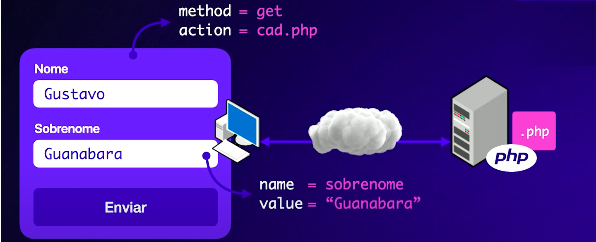
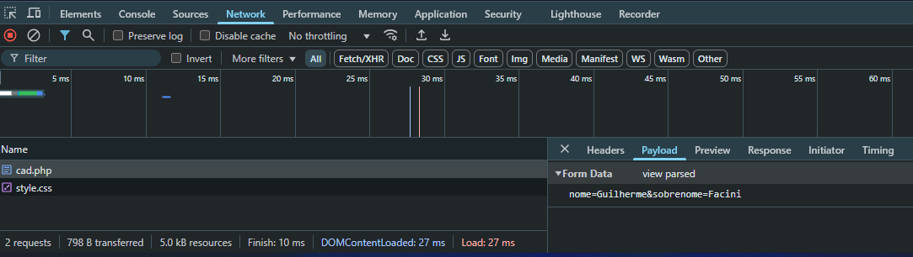
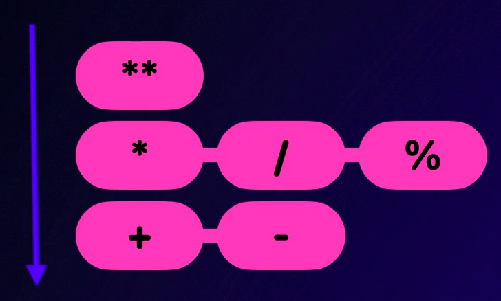
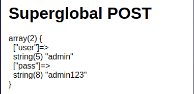
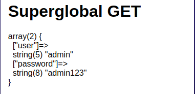
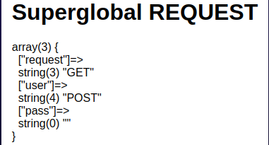
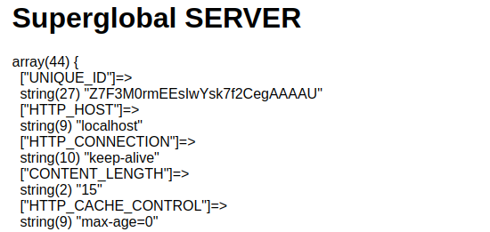

# Curso de PHP Moderno: Módulo 01 [40 HORAS]

# Capitulo 1: Introdução

PHP (PHP: Hypertext Pré-processor) voltada para desenvolvimento Web, sendo ela hoje (09/01/2025) a maior linguagem para esse meio tomando conta de **79,2% de todos os sites atuais.
O PHP foi desenvolvido pelo canadense Rasmus Lerdof.**

> O código PHP é geralmente processado em um [servidor web](https://en.wikipedia.org/wiki/Web_server) por um [interpretador](https://en.wikipedia.org/wiki/Interpreter_(computing)) PHP implementado como um [módulo](https://en.wikipedia.org/wiki/Plugin_(computing)) , um [daemon](https://en.wikipedia.org/wiki/Daemon_(computing)) ou um executável [Common Gateway Interface](https://en.wikipedia.org/wiki/Common_Gateway_Interface) (CGI). Em um servidor web, o resultado do código PHP [interpretado](https://en.wikipedia.org/wiki/Interpreter_(computing)) e executado — que pode ser qualquer tipo de dado, como [HTML](https://en.wikipedia.org/wiki/HTML) gerado ou dados de imagem [binária](https://en.wikipedia.org/wiki/Binary_number) — formaria a totalidade ou parte de uma resposta [HTTP](https://en.wikipedia.org/wiki/HTTP) . Existem vários [sistemas de modelo web](https://en.wikipedia.org/wiki/Web_template_system) , [sistemas de gerenciamento de conteúdo](https://en.wikipedia.org/wiki/Content_management_system) web e [estruturas web](https://en.wikipedia.org/wiki/Web_framework) que podem ser empregados para orquestrar ou facilitar a geração dessa resposta. Além disso, o PHP pode ser usado para muitas tarefas de programação fora do contexto web, como [aplicativos gráficos autônomos](https://en.wikipedia.org/wiki/Graphical_user_interface) [[ 15 ]](https://en.wikipedia.org/wiki/PHP#cite_note-15) e controle [de drones .](https://en.wikipedia.org/wiki/Unmanned_aerial_vehicle) [[ 16 ]](https://en.wikipedia.org/wiki/PHP#cite_note-16) O código PHP também pode ser executado diretamente a partir da [linha de comando](https://en.wikipedia.org/wiki/Command-line_interface) .     [Wikipedia](https://en.wikipedia.org/wiki/PHP)
> 

## 1.1 php.ini

O php.ini é o principal arquivo de configuração do PHP, sendo ele o responsável por ativar e desativar funções como:

- display_erro: Função que mostra na aplicação os erros de sintaxe do código.
- short_open_tags: Função que habilita o uso dessa tag **<? ?>**.

Entre outras…

---

## 1.2 Variáveis e Constantes

Variáveis e Constantes são endereços de memória “nomeado” que armazenam um conteúdo especificado pelo programador, esse conteúdo pode ser dinâmico, ou seja, pode ser alterado a qualquer momento, ou estático, onde não é alterando em momento algum.

```php
/*
Em sua declaração há uma grande diferença.
para declarar uma variavel, utilizamos o icone $ em seguida o nome da mesma:
*/
$nome = 'Guilherme' //string
$idade = 20 //int
$peso = 90.0 //float or double
$casado = true // boolean

/*
Já na declaração de constantes é necessário a sintaxe:
*/
const PAIS = 'Brasil'
```

# Capitulo 2: Tipos primitivos

O PHP tem 3 categorias de tipos primitivos assim como mostro abaixo…

| Escalares | Compostos | Especiais |
| --- | --- | --- |
| string | array | null |
| integer | object | resource |
| float/double |  | callabe |
| boolean |  | mixed |

## 2.1 Escalares

As variaveis no PHP podem ter diferentes tipos, sendo eles:

- String - são uma sequencia de caracteres que podem formar, palavras, frases, textos etc…
- Integer - números inteiros (naturais), e também numeros em diferentes bases, como hexadeciamal (0x), binário (0b) e Octal (0).
- Float / Double - números com ponto flutuante (.)
- Boolean - Verdadeiro ou Falso (true , false)

> Durante o debug dos projetos, podemos utilizar a função **var_dump** que mostra informações sobre a váriavel, como seu tipo, valor, tamanho etc…
> 

### 2.1.1 Coerção de tipos

Os tipos das variaveis podem ser “alteradas” utilizando a coerção de tipos, onde em sua declaração você pode forçar tal tipo, exemplo:

```php
$num = (string) 32
var_dump($num) // string(2) "32"
```

## 2.2 Compostos

Os tipos compostos são tipos que lidam com 1 ou + valores, como exemplo o array.

### 2.2.1 Array

O array é uma sequencia de endereços de memória previamente endereçados para o armazenamento continuo de “variáveis”, exemplo:

```php
$vetor = [0, 1, 2, 3, 4, 5, 6];
var_dump($vetor); // array(7) {[0] => int(0), [1] => int(1)...}
```

> No PHP um array pode ter diferentes tipos primitivos em si mesmo, podendo assim lidar com uma grande base de dados, mesmo que desorganizada.
> 

### 2.2.2 Object

O tipo Object é geralmente utilizado na programação orientada a objetos(POO), pois permite que pequenas partes do código conversem entre si, podendo assim definir cada parte do código a uma responsábilidade no programa.

```php
class Pessoa {
	private string $name;
}
$pessoa = new Pessoa;
var_dump($pessoa) // object(Pessoa)...
```

# Capitulo **3: Manipulação de strings com PHP**

Para entender a manipulação de strings, é necessário que conhecessemos os tipos de strings, sendo eles:

- Double Quoted
- Single Quoted
- Heredoc
- Nowdoc

## 3.1 Single/Double Quoted

Double Quoted ou Aspas Duplas são as strings que tem como operador de concatenação o “.”, como mostra a imagem a o lado:

Tendo como principal diferença das strings de aspas simples, a INTERPRETAÇÂO, por exemplo:

![curso[dot]php.png](downloads/d013/imagens/notes/curso[dot]php.png)

```php
// VARIAVEIS
$php = "PHP \u{1F418}"; // PHP 🐘
$php = 'PHP \u{1F418}'; // PHP \u{1F418}

//CONSTANTES
const ESTADO = "SP";
echo "eu amo ESTADO" // eu amo ESTADO
echo "eu amo " . ESTADO // eu amo SP
```

Por padrão “” podem estar dentro de ‘’ e vice-versa, porém para a utilização de “” dentro de “”, podendo ser aplicado por exemplo, para a adição de um apelido, utilizamos  a sintaxe abaixo:

```php
$nome = 'Charles';
$sobrenome = 'Oliveira';

echo "$nom \"DoBronxs\" $sobrenome" //Charles "DoBronxs" Oliveira
```

O nome disso é “sequencia de escape” onde são aplicados para que não haja ERRO na manipulação de Strings no PHP, onde existem alguns, exemplo:

- \n - Nova linha
- \t - Tabulação horizontal
- \\ - Barra invertida
- \$ - Sifrão
- \u{} - Caracteres Unicode

## 3.2 Sintaxe Heredoc

A Sintaxe Heredoc é normalmente utilizanda na criação de paragrafos, frases etc… Pois permite a manipulação de strings em campos de textos muito maiores, exemplo:

```php
$curso = "PHP";
$ano = date("Y");
echo <<< FRASE
    Estou estudando "$curso" em $ano
FRASE;
```

Onde tudo que estiver dentro de **echo <<< FRASE FRASE;** poderá ser manipulado.

# Capitulo **4: Obtendo dados de formulários com PHP**

Na criação de um formulário.html, existem alguns campos que devem ser preenchidos para que possamos obter os dados do mesmo, seja para manipulação, ou o armazenamento desses dados em um banco de dados.



## 4.1 Explicando código

### 4.1.1 <form>

Na criação de nosso formulário na linha, temos alguns paramentros sendo passados, sendo eles o action e method. O action informará o servidor qual arquivo.php será utilizado para o processamento, como exemplo o cad.php.

```html
<form action="cad.php" method="get">
```

Já o method designa o tipo de requisição HTTP será realizada, podendo ser GET ou POST, sendo suas principais diferenças a forma em que os parâmetros são passados. Quando utilizamos o GET, os parametros são passados no cabeçalho da requisição. Podendo ser vistos pela URI.

Exemplo:

```
http://localhost/php-moderno/ex004/cad.php?nome=Guilherme&sobrenome=Facini
```

Já quando utilizamos POST, os parametros são enviados no corpo da requisição HTTP, escondendo eles da URI. Mas não é isso que impede que os dados sejam vistos, pois os mesmo podem ser observados utilizando o DevTools.



### 4.1.2 <input>

Para isso precisamos do campo <input> pois a partir dele conseguimos obter os dados do usuário, mas para isso precisamos entender seus parametros, sendo eles name, id e value.

O **name** é o principal paramentro que utilizaremos, pois ele que o PHP utiliza para “processar” esses dados. Esse processamento ocorre quando utilizamos as Super Globais **$_GET**/**$_POST**/**$_REQUEST**.
Essas variaveis são arrays que são preenchidos de acordo com sequencia estabelecida no código, o nosso será:

```php
var_dump($_GET);
// array(2) { ["nome"]=> string(9) "Guilherme" ["sobrenome"]=> string(6) "Facini" }

// Sabendo disso, para obter os dados armazenados faremos como qualquer array:
$nome = $_GET["nome"];
$sobrenome = $_GET["sobrenome"];
```

Tendo esse conhecimento já podemos realizar a criação de nosso formulário, e obter dados do mesmo, com essa representação em código:

```html
<section>
	<form action="cad.php" method="get">
		<label for="nome">Nome</label>
		<input type="text" name="nome" id="idnome">
		<label for="sobrenome">Sobrenome</label>
		<input type="text" name="sobrenome" id="idsobrenome">
	</form>
</section>
```

# **Capitulo 5: Matemática com PHP**

## 5.1 **Expressões Aritméticas**

Ás expressões aritméticas no PHP funcionam seguindo as bases da matemática comum, seguindo a ordem de precedência dos operadores, assim como observado ao lado: 

Porém essa ordem de precedência, pode ser manipulada quando utilizamos  os (parenteses), onde às expressões que tiverem os parenteses ganham prioridade em sua execução.



## 5.2 Funções Aritméticas

### 5.2.1 Funções abs()

A abs() tem como função nos informar o valor absoluto de número, mas o que é um valor absoluto? de acordo com a [Wikipedia](https://pt.wikipedia.org/wiki/Valor_absoluto)

> **Valor absoluto** pode significar:
> 
> - [Função modular](https://pt.wikipedia.org/wiki/Fun%C3%A7%C3%A3o_modular): a operação matemática que consiste em "tirar o sinal" de um número, ou seja, levar um número e seu inverso aditivo ao mesmo número, chamado de seu módulo.
> - [Valor absoluto (álgébra)](https://pt.wikipedia.org/wiki/Valor_absoluto_(%C3%A1lgebra)): conceito de álgébra abstrata que tem algumas propriedades em comum com a função modular (como que o resultado da operação é um número real, a desigualdade triangular para a soma, e que o valor absoluto de um produto é o produto dos valores absolutos), mas que pode ter outras propriedades não intuitivas (como que o valor absoluto de um inteiro pode ser menor que um)
>     - Na filosofia da Ética, é um tema de debate se um [valor](https://pt.wikipedia.org/wiki/Valor_(%C3%A9tica)) pode ser absoluto ou se é sempre relativo.

Simplificando a função abs() retira o sinal de um número, como exemplo:

```php
$n_absoluto = abs(-2000);
echo "$n_absoluto" // 2000
```

### 5.2.2 Função base_convert()

Assim como seu nome diz, essa função realiza a conversão de bases numéricas, sendo suas principais:

- Binaria - 2
- Octal - 8
- Decimal - 10
- Hexadecimal - 16

Para a utilização dessa função, apenas siga a sintaxe:

```php
// base_convert(numero, base, base_convertida)

base_convert(254, 10, 16); // 0xfe
// conversão de Decimal para Hexadicimal

base_convert(1101, 2, 10); // 11
// conversão de Binario para Decimal
```
# Capítulo 6: Superglobais no PHP

Às Superglobais em PHP são variaveis que armazenam  em um array, cada parâmetro sendo ela uma requisição(GET, POST ou Ambas), um Cookie, Sessão, Variáveis de ambiente etc…

## 6.1 $_GET

A superglobal GET armazena os parâmetros enviados ao servidor utilizando a requisição GET do HTTP.

A requisição GET pode ser enviada de diferentes formas, sendo elas a passagem de parâmetros via URL ou a passagem via requisição HTTP manual.

A passagem de parâmetros via URL, funciona com o 1º parâmetro ter ? antecedendo o mesmo e caso tenham outros parâmetros os mesmos devem ter um & separando-os.

```jsx
https://example.com/index.php?user=admin&password=admin123
```

Conseguindo obter o mesmo resultado através de uma requisição HTTP manual, utilizando por exemplo o cURL na passagem de parâmetro:

```jsx
GET /?user=admin&password=admin123 HTTP/1.1
Host: exemple.com
Connection: close
```

## 6.2 $_POST

A superglobal POST assim com a GET enviam parâmetros ao servidor, porém utilizando a requisição POST do HTTP.

Também podendo ser enviadas requisições manuais utilizando clients HTTP como cURL, o POST envia comumente seus parâmentros através de PAYLOADS, que funcionam como rodapé da requisição.

```jsx
POST /login HTTP/1.1
Host: exemple.com
Content-Type: application/x-www-form-urlencoded
Content-Length: 29

user=admin&password=admin123
```

## 6.3 $_REQUEST

Já a superglobal REQUEST armazena ambos tipos de requisição, sendo ele GET ou POST variando somente qual é armazenado primeiro. Se enviados juntos o GET sempre será armazenado primeiro, pois é uma requisição mais simples sendo mais rápido seu processamento.

## 6.4 $_SERVER

Saindo das Superglobais de requisições HTTP, temos a SERVER que armazena em seu array, informações sobre o Servidor, podendo ser acessadosatravés de seus indexes.



## 6.5 $_FILES

Superglobal que uma ferramenta crucial para lidarmos com uplouds de arquivos em formularios HTTP. Ela armazena informações sobre os arquivos enviados via o método HTTP POST, quando o formulário possui o atributo `enctype="multipart/form-data"`. Através dessa superglobal, você pode acessar detalhes do arquivo, como nome, tipo, tamanho, erro de upload e o caminho temporário onde o arquivo foi armazenado no servidor.

### 6.5.1 Estrutura de `$_FILES`

Cada chave representa um campo de upload de arquivo no formulário HTML. Cada chave contém as seguintes informações:

1. **`name`**: O nome original do arquivo no sistema de arquivos do cliente.
2. **`type`**: O tipo MIME do arquivo (por exemplo, `image/jpeg`, `application/pdf`, etc.).
3. **`size`**: O tamanho do arquivo em bytes.
4. **`tmp_name`**: O caminho temporário do arquivo no servidor, onde o arquivo foi armazenado durante o processo de upload.
5. **`error`**: Um código de erro que descreve o status do upload.

A estrutura básica de `$_FILES` é a seguinte:

```php
$_FILES = array(
    'nome_do_input' => array(
        'name' => 'nome_do_arquivo.ext',
        'type' => 'tipo_mime',
        'size' => 123456,
        'tmp_name' => 'caminho_temporario',
        'error' => 0 // Código de erro
    )
);
```

## 6.6 $_ENV

Superglobal com iberação para leitura de informações das variáveis de ambientes.

Em inglês “Desktop Enviroments”, às variaveis de ambientes são variaveis que armazenam o caminho de binarios, programas etc… para melhor utilização de um programa, exemplo:

```bash
echo $PATH ;/usr/local/sbin:/usr/local/bin:/usr/sbin:/usr/bin:/sbin:/bin:/usr/games:/usr/local/games:/snap/bin:/snap/bin
```

Essa variavel pode ser utilizada para o acesso de informações como credenciais de um Banco de Dados

- **Em servidores Apache**: As variáveis de ambiente podem ser definidas no arquivo de configuração do Apache (`.htaccess`):
    
    ```bash
    SetEnv DB_HOST "localhost"
    SetEnv DB_USER "root"
    ```
    
- **Em servidores Nginx**: As variáveis podem ser configuradas no arquivo de configuração do Nginx:
    
    ```bash
    fastcgi_param DB_HOST "localhost";
    fastcgi_param DB_USER "root";
    ```
    
- **Usando em frameworks**: Em frameworks como Laravel, Symfony, etc., as variáveis de ambiente são carregadas do arquivo `.env` diretamente para o array `$_ENV`, o que facilita a configuração de parâmetros sensíveis (como credenciais de banco de dados).

## 6.7 $_SESSION

A superglobal SESSION armazenar e acessar dados durante a sessão do usuário. Esses dados são armazenados no servidor e associados a um identificador único de sessão, que é passado ao cliente por meio de um **cookie** ou na própria URL.

Para iniciar uma sessão você precisa chamar `session_start();` no inicio de seu script. Permitindo que o PHP associe as informações armazenadas na sessão com o usuário.

```php
session_start();
$_SESSION['username'] = 'johndoe';
$_SESSION['email'] = 'john@example.com';
$_SESSION['cart'] = ['item1', 'item2'];
$_SESSION['cart'][] = 'item3'; // Adiciona 'item3' ao carrinho

echo $_SESSION['username']; // Imprime 'johndoe'
echo $_SESSION['email']; // Imprime 'john@example.com'

unset($_SESSION['email']); // Remove a variável 'email' da sessão

session_unset(); // Remove todas as variáveis da sessão
session_destroy(); // Destrói a sessão
```

### 6.7.1 Informações importantes

- **Segurança**: Como as sessões mantêm dados críticos (como informações de login), é importante proteger o ID de sessão. Se alguém conseguir roubar o ID da sessão, pode acessar as informações associadas a ela.
    - **Usar HTTPS** para garantir que o ID da sessão não seja interceptado.
    - Configurar o PHP para **gerar IDs de sessão seguros** e usar **cookie seguro** (usando a opção `session.cookie_secure` no `php.ini`).
    - **Regenerar o ID de sessão** após login usando `session_regenerate_id()` para evitar ataques de sequestro de sessão.
- **Limpeza de sessão**: O PHP possui um mecanismo interno para expirar e limpar sessões antigas, mas você pode configurar o tempo de expiração no `php.ini` usando `session.gc_maxlifetime`.

## 6.8 $_COOKIE

A superglobal COOKIE armazena dados enviados pelo cliente para o servidor, que são armazenados no navegador em formato de cookies. Cookies são pequenos arquivos de texto que o servidor pode enviar para o navegador do cliente, e esses arquivos são enviados de volta ao servidor em requisições subsequentes. Eles são comumente usados para armazenar informações de sessão, preferências do usuário, entre outros dados que precisam persistir entre as requisições.

### Exemplo de uso de $_COOKIE:

```php
// Definir um cookie
setcookie('user', 'John Doe', time() + 3600, '/'); // O cookie expirará em 1 hora

// Acessar o valor do cookie
echo $_COOKIE['user']; // Imprime 'John Doe'

```

### 6.8.1 Informações sobre COOKIES

- Os cookies são enviados automaticamente pelo navegador com cada requisição subsequente para o mesmo domínio.
- O PHP oferece funções para manipular cookies, como **setcookie()**, **$_COOKIE**, **setrawcookie()**, etc.
- A duração de um cookie é definida pelo valor do tempo de expiração ao usar `time()` (em segundos). Se o tempo de expiração for definido como zero ou não for fornecido, o cookie será tratado como um cookie de sessão e será apagado quando a sessão do navegador for encerrada.
- É importante que, ao usar cookies, você considere questões de privacidade e segurança, além de garantir que os cookies sejam enviados apenas por conexões seguras (HTTPS).

## 6.9 $GLOBALS

A superglobal GLOBALS é uma variável especial do PHP que permite acessar todas as variáveis globais, ou seja, aquelas que estão fora de funções, classes ou escopos locais. Ela é um array associativo que contém todas as variáveis globais do script, e você pode usá-la para acessar e modificar essas variáveis em qualquer lugar do código, inclusive dentro de funções.

Quando você utiliza a superglobal **$GLOBALS**, você pode acessar qualquer variável global diretamente através de seu nome, sem precisar usar o operador `global`.

```php
// Variáveis globais
$a = 10;
$b = 20;

function soma() {
    // Acessando variáveis globais dentro de uma função
    $GLOBALS['a'] = 5; // Modificando a variável global $a
    $GLOBALS['b'] = 10; // Modificando a variável global $b
    return $GLOBALS['a'] + $GLOBALS['b']; // Acessando as variáveis globais
}

echo soma(); // Saída: 15
echo $a; // Saída: 5 (valor da variável global $a modificado pela função)
echo $b; // Saída: 10 (valor da variável global $b modificado pela função)

```